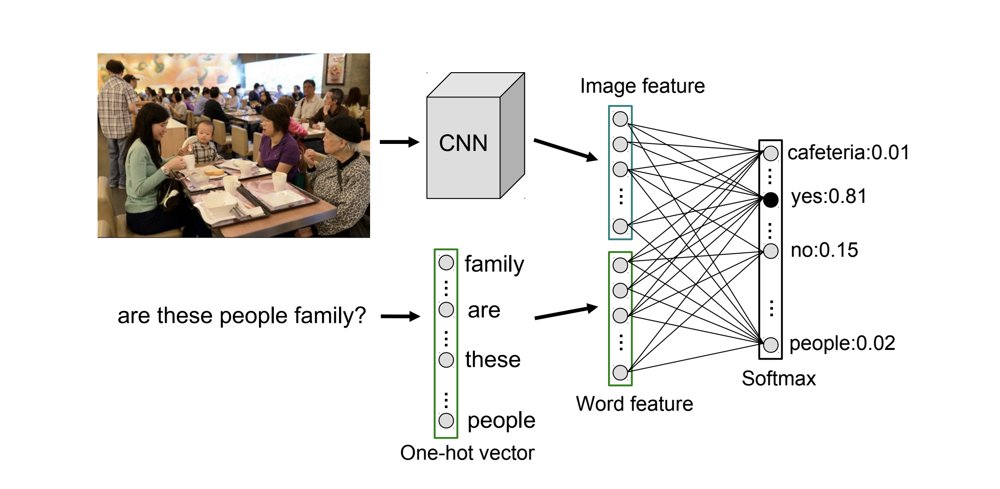
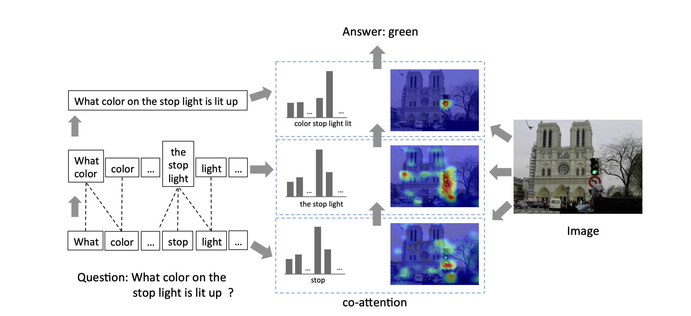
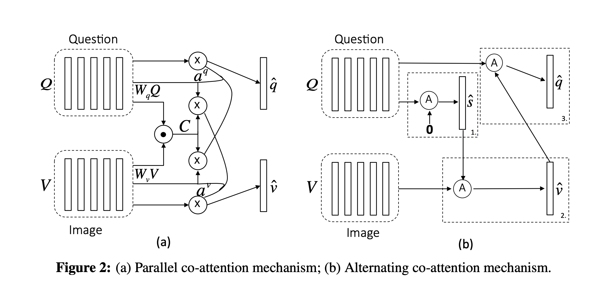
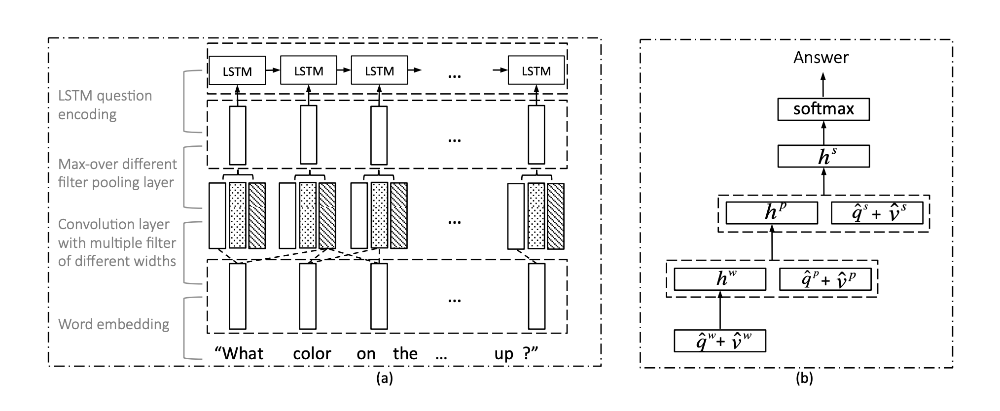
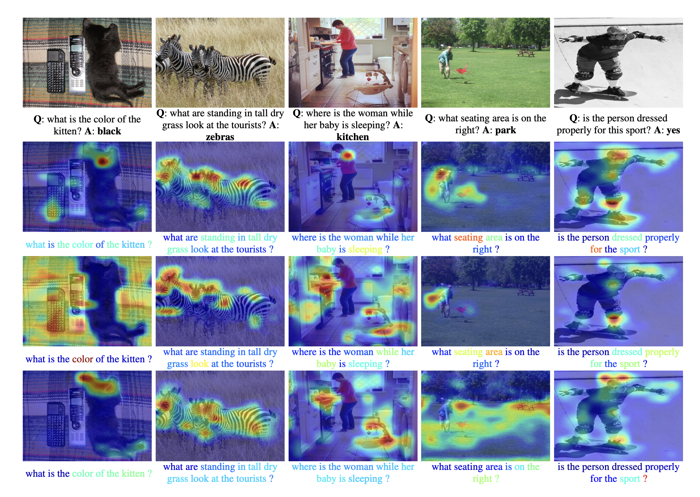

# Visual Question Answering Task
*When given an image and a natural language question about the image, the task is to predict an accurate natural language answer.*
- **Models Implemented**:
  1. Simple Baseline for VQA. [Paper](https://arxiv.org/abs/1512.02167)
  1. Heirarchial Question-Image Co-Attention Mechanism for VQA. [Paper](https://arxiv.org/abs/1606.00061)
---
- **Content**:
  - main.py`(All the initializations of the task are started here)`
  - vqa.py`(A file to handle the paths and links for the VQA dataset)`
  - simple_baseline_net.py `(Has the torch module for the Simple Baseline Net architecture)`
  - simple_baseline_dataset.py `(Has the torch Dataset module that feeds the tensors during training)`
  - simple_baseline_experiment_runner.py `(Runner, Has all the optimizers+training+validation functions)`
  - CoAtt_Preprocess.pt `(Preprocessing code for CoAttentionNet )`
  - coatt_utils.pt `(Utils/supporting files for CoAttentionNet )`
  - coattention_net.py `(Has the torch module for the CoAttention Net architecture)`
  - coatt_vqa_dataset.py `(Has the torch Dataset module that feeds the tensors during training)`
  - coattention_experiment_runner.py `(Runner, Has all the optimizers+training+validation functions)`
    ### **To Run this code on your Machine**
    #### Initial setup
       1. Download the [Visual VQA dataset](https://visualqa.org/) and copy that into the Data folder.
    #### For Simple Baseline Net:
       1. `python main.py --model simple`
    #### For CoAttention Net:
       1. Download the GloVe.6B.300d.txt file.
          `wget http://nlp.stanford.edu/data/glove.6B.zip` and then `unzip glove.6B.zip -d ./supportfiles/`
       2. Run the `CoAttention_preprocess.py` to generate the pickle objects required to run the model experiment runner.
       3. `python main.py --model coattention`
### Architectures and models:
Simple bag of words model

Parallel CoAttention Model:

